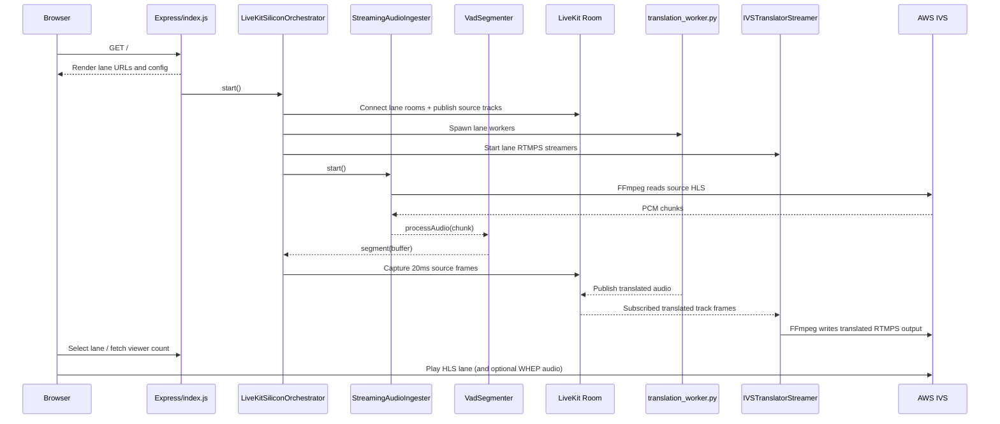

# LiveLingo Process Flow

This document describes the current LiveKit + SiliconFlow runtime architecture used by LiveLingo.

## 1. Architecture Summary

LiveLingo is an Express app that runs a server-side translation orchestrator:

1. UI plays source or translated live lanes.
2. FFmpeg ingests source HLS/IVS audio as PCM.
3. VAD emits speech segments.
4. Orchestrator publishes segment audio into per-language LiveKit rooms.
5. Python workers translate in realtime through SiliconFlow (`qwen3.5-omni-flash`).
6. Orchestrator subscribes translated audio tracks and forwards them to per-language IVS RTMPS outputs.

Core files:

- [index.js](index.js)
- [StreamingAudioIngester.js](StreamingAudioIngester.js)
- [VadSegmenter.js](VadSegmenter.js)
- [ivsTranslatorStreamer.js](ivsTranslatorStreamer.js)
- [agents/translation_worker.py](agents/translation_worker.py)

## 2. Server Startup and Orchestrator Lifecycle

At HTTP startup:

1. Express routes and static assets are mounted.
2. Transcript WebSocket server is mounted at `/ws/transcripts`.
3. If `AUTO_START_ORCHESTRATOR=true`, orchestrator auto-starts.

Orchestrator controls:

- `POST /orchestrator/start`: starts pipeline (idempotent while running).
- `POST /orchestrator/stop`: performs graceful stop.
- `GET /health`: returns status, provider, and live orchestrator stats.

## 3. UI and Route Flow

Public routes:

- `GET /`: main multi-lane player.
- `GET /dashboard`: simple single-stream page.
- `GET /create-new-livestream`: form page.
- `POST /create-new-livestream`: currently echoes payload.

Operational routes:

- `GET /api/ivs/live-viewers`: placeholder viewer count by language.
- `GET /health`: server + orchestrator state.

Home page behavior:

1. Shows lanes: `original`, `hindi`, `bangla`, `tamil`.
2. Uses native HLS when available, otherwise HLS.js for `.m3u8`.
3. If `USE_WEBRTC_TRANSLATED_AUDIO=true` and non-original lane is selected, attempts WHEP (`WEBRTC_WHEP_URL_*`).
4. Falls back to stream audio if translated WebRTC track does not arrive.

## 4. Playback URL Resolution

Playback URLs are normalized in `index.js`:

1. Source candidates come from `AWS_IVS_PLAYBACK_URL` or `LIVESTREAM_HLS_URL`.
2. Lane outputs come from `AWS_IVS_PLAYBACK_URL_HINDI`, `AWS_IVS_PLAYBACK_URL_BANGLA`, `AWS_IVS_PLAYBACK_URL_TAMIL`.
3. Relative channel paths are joined against `CLOUDFRONT_PLAYBACK_BASE_URL` or `PLAYBACK_BASE_URL`.
4. If scheme is missing, URL is normalized to `https://`.

## 5. Source Audio Ingestion and Segmentation

Ingestion:

1. `StreamingAudioIngester` runs FFmpeg on source HLS URL.
2. FFmpeg outputs mono PCM (`s16le`, 16kHz) on stdout.
3. Ingester emits `audio-data` events to orchestrator.
4. On failure, ingester retries with exponential backoff up to configured limit.

Segmentation (`VadSegmenter`):

1. Audio is analyzed in fixed VAD frames.
2. Speech state is determined by energy threshold.
3. Segment emits when silence tail reaches configured `silenceMs`.
4. Hard cutoff emits a segment when max internal buffer window is reached.
5. On shutdown, `flush("shutdown_flush")` emits remaining buffered audio.

## 6. LiveKit Lane Topology

Configured lanes:

- Hindi: lane key `hindi`, language code `hi-IN`, room `translation-hi`
- Bangla: lane key `bangla`, language code `bn-IN`, room `translation-bn`
- Tamil: lane key `tamil`, language code `ta-IN`, room `translation-ta`

For each lane, orchestrator:

1. Creates a LiveKit room connection using JWT grant (`roomJoin`, publish, subscribe).
2. Publishes local audio track from `AudioSource` (16kHz mono).
3. Starts `IVSTranslatorStreamer` for that language.
4. Spawns lane-dedicated Python worker.
5. Subscribes first eligible remote translated audio track and pipes it to streamer.

## 7. Worker Runtime (Python)

`agents/translation_worker.py`:

1. Starts as a LiveKit agent worker bound to one room.
2. Rejects jobs for other rooms.
3. Connects to SiliconFlow OpenAI-compatible realtime endpoint.
4. Uses `qwen3.5-omni-flash` with translation-only instruction.
5. Uses Silero VAD with interruptions disabled.
6. Emits translated audio tokens back to the same room.

## 8. Segment Broadcast and Backpressure Policy

For each VAD segment:

1. Orchestrator computes lag from `segment.emittedAt`.
2. If lag exceeds `LIVEKIT_MAX_QUEUE_MS`, segment is dropped.
3. Otherwise segment is split into 20 ms PCM frames and captured into each lane `AudioSource`.

This keeps translation near realtime and avoids growing queue latency.

## 9. IVS Translation Output Flow

`IVSTranslatorStreamer` per lane:

1. Builds ingest URL from `AWS_IVS_INGEST_URL_*` + `AWS_IVS_STREAM_KEY_*`.
2. Starts FFmpeg to publish FLV/RTMPS.
3. Video source:
   - source HLS video when `IVS_TRANSLATED_USE_SOURCE_VIDEO=true`
   - fallback generated black video otherwise
4. Audio source: translated PCM frames written to FFmpeg stdin.

Queue and continuity behavior:

1. Sequence-based queue ensures ordered playout.
2. Duplicate/stale/near-duplicate chunks are filtered.
3. Missing sequence numbers are skipped after timeout (`IVS_MAX_MISSING_SEQUENCE_WAIT_MS`).
4. Background bed is mixed when translated audio is missing:
   - music file if available
   - synthesized fallback bed otherwise
5. FFmpeg failure triggers exponential reconnect attempts.

## 10. Transcript and Monitoring Flow

Transcript channel:

1. Server keeps latest 20 transcript entries in-memory.
2. WS clients connecting to `/ws/transcripts` receive `transcript-init`.
3. New entries are pushed as `transcript-new`.

Observability:

1. Orchestrator emits `started`, `warning`, `error`, `segment-broadcast`, and periodic `metrics`.
2. Metrics include uptime, segment counts, drop counts, ingester/vad stats, and per-lane streamer queue stats.
3. `/health` includes these stats when orchestrator is running.

## 11. Graceful Shutdown Flow

On `SIGINT`/`SIGTERM`:

1. Stop metrics timer.
2. Flush VAD tail.
3. Stop audio ingester.
4. Terminate worker processes.
5. Disconnect LiveKit rooms and clear lane state.
6. Stop each IVS streamer.
7. Exit process.

## 12. Main Configuration Inputs

Core:

- `PORT`
- `AUTO_START_ORCHESTRATOR`
- `SILICONFLOW_API_KEY`
- `PYTHON_BIN`

Playback/input URLs:

- `AWS_IVS_PLAYBACK_URL`
- `LIVESTREAM_HLS_URL`
- `CLOUDFRONT_PLAYBACK_BASE_URL`
- `PLAYBACK_BASE_URL`
- `AWS_IVS_PLAYBACK_URL_HINDI`
- `AWS_IVS_PLAYBACK_URL_BANGLA`
- `AWS_IVS_PLAYBACK_URL_TAMIL`

LiveKit:

- `LIVEKIT_URL`
- `LIVEKIT_API_KEY`
- `LIVEKIT_API_SECRET`
- `LIVEKIT_MAX_QUEUE_MS`
- `LIVEKIT_AUDIO_QUEUE_SIZE_MS`
- `LIVEKIT_CONNECT_RETRIES`
- `LIVEKIT_CONNECT_RETRY_DELAY_MS`
- `LIVEKIT_VAD_FRAME_MS`
- `LIVEKIT_VAD_ENERGY_THRESHOLD`
- `LIVEKIT_VAD_SILENCE_MS`

IVS output:

- `AWS_IVS_INGEST_URL_HINDI` / `AWS_IVS_STREAM_KEY_HINDI`
- `AWS_IVS_INGEST_URL_BANGLA` / `AWS_IVS_STREAM_KEY_BANGLA`
- `AWS_IVS_INGEST_URL_TAMIL` / `AWS_IVS_STREAM_KEY_TAMIL`
- `IVS_TRANSLATED_USE_SOURCE_VIDEO`
- `VIDEO_SYNC_DELAY_SEC`
- `IVS_MAX_MISSING_SEQUENCE_WAIT_MS`

WebRTC lane audio (UI):

- `USE_WEBRTC_TRANSLATED_AUDIO`
- `WEBRTC_WHEP_URL_ORIGINAL`
- `WEBRTC_WHEP_URL_HINDI`
- `WEBRTC_WHEP_URL_BANGLA`
- `WEBRTC_WHEP_URL_TAMIL`

## 13. End-to-End Sequence

## 14. One-Line Mental Model

Ingest source audio, segment with VAD, fan out to LiveKit language rooms, translate via SiliconFlow workers, and stream each translated lane back to IVS for playback.